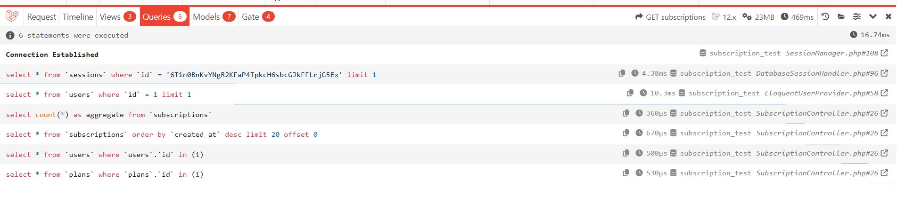
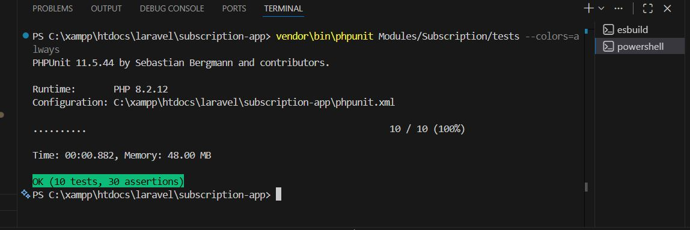
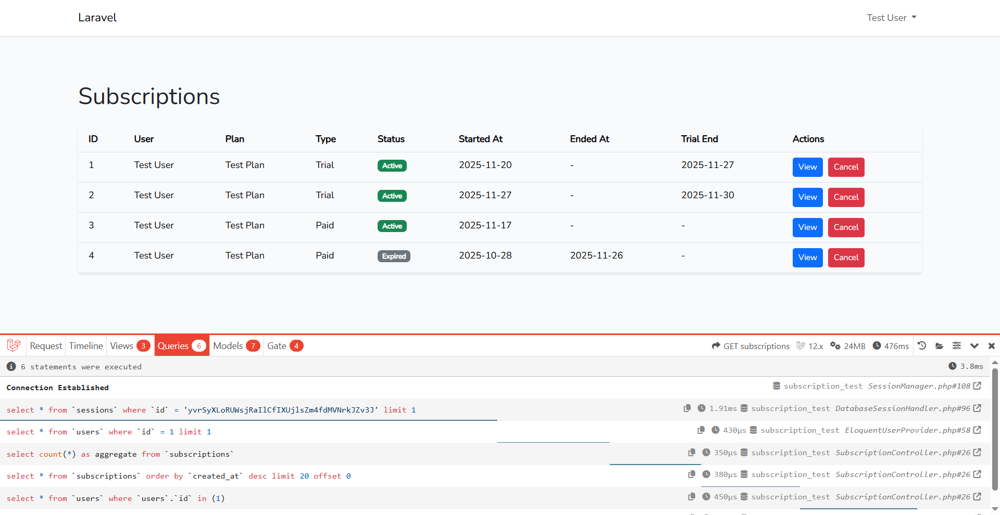
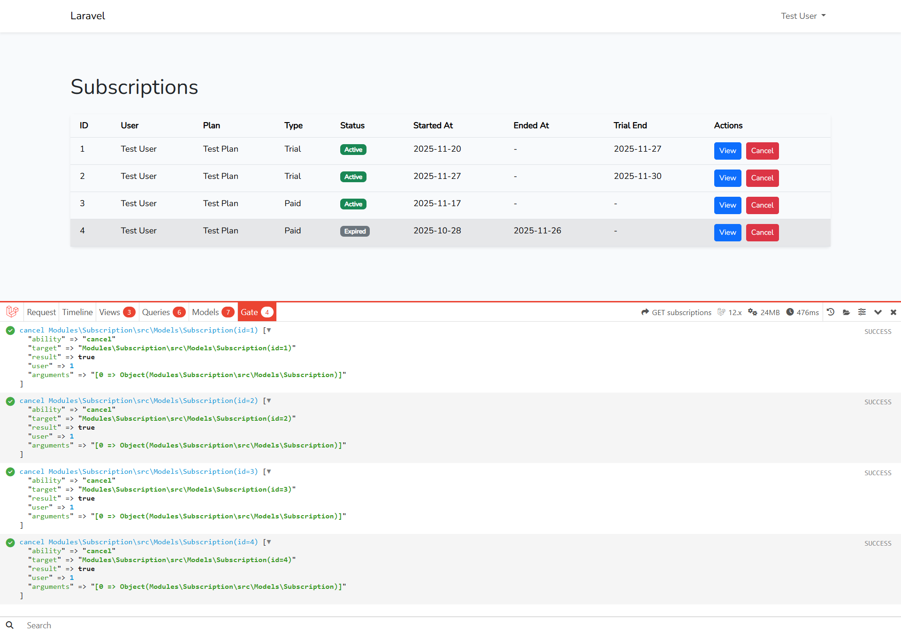

# Subscription Module – Laravel Refactor

This module is a full Laravel refactor of a legacy Yii2 subscription slice. The goal was to rebuild the module using clean Laravel architecture, proper authorization, a complete trial system, performance fixes, and automated workflows — all supported with a full test suite.

---

## Key Features

### Clean Architecture

-   Business logic moved out of controllers
-   Models contain only entity logic
-   Policies handle all authorization
-   Commands and Jobs manage automation
-   Blade views contain zero business logic

### Trial System

-   7-day trial automatically created
-   Expired trials automatically converted to paid
-   Email notification dispatched through a queued Job

---

## Performance – N+1 Fix

The original code suffered from N+1 queries.

The fix uses eager loading:

```php
Subscription::with(['user', 'plan'])
```

This reduces the query count to:

-   1 query for subscriptions
-   1 query for users
-   1 query for plans

### N+1 Proof



---

## Security & Authorization

Authorization is handled via `SubscriptionPolicy`:

-   Admins → full access
-   Users → can only view/cancel their own subscriptions

Controllers enforce this using:

```php
$this->authorize('view', $subscription);
```

and:

```php
$this->authorize('cancel', $subscription);
```

---

## Automation (Command + Queue)

### Daily Command

```
php artisan subscriptions:convert-trials
```

-   Detects expired trials
-   Converts them into paid subscriptions
-   Dispatches a queue job for email notification

### Job: `SendSubscriptionEmailJob`

-   Queue-driven
-   Sends a `SubscriptionEmail` mailable
-   Fully isolated from controller logic

---

## Test Coverage

Covers:

-   Trial conversion logic
-   Queue job dispatching
-   Authorization access rules
-   Model helpers & scopes
-   Email sending behavior
-   Feature-level endpoint access

All tests pass:

```
OK (10 tests, 30 assertions)
```

---

## Screenshots

### 1) Subscriptions Page UI



### 2) Debugbar Visible

```

```

### 3) N+1 Queries Fix Proof


---

## Project Structure

```
src/Models
src/Policies
src/Jobs
src/Providers
src/Http/Controllers
database/migrations
database/factories
database/seeders
tests/Feature
tests/Unit
resources/views
```

---

## Installation

1. Install dependencies
2. Run migrations
3. Seed database (optional)
4. Start local server
5. Run queue worker for emails

---

## Summary

The module now provides:

-   Clean and maintainable architecture
-   Strong authorization boundaries
-   Fully automated trial lifecycle
-   Optimized database queries (N+1 fixed)
-   Safe, idempotent migrations
-   Queue-based notifications
-   Full test coverage

A complete upgrade over the original Yii2 version, rebuilt using modern Laravel practices.
